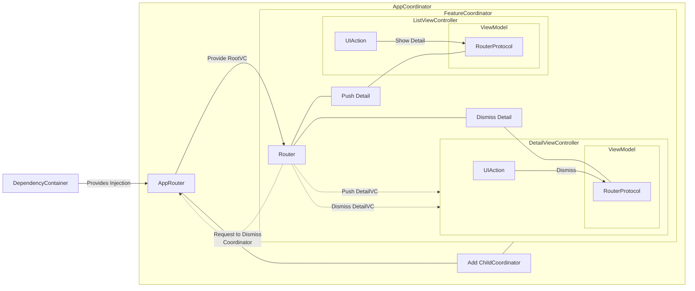

# Architecture

```mermaid
flowchart LR
    DC[DependencyContainer] -- Provides Injection --> AP
    subgraph AC[AppCoordinator]
        AP[AppRouter]
        subgraph FC[FeatureCoordinator]
            FCR[Router]
            subgraph FCVC[ListViewController]
                subgraph FCVM[ViewModel]
                    FCRP[RouterProtocol]
                end
                UIA1[UIAction] -- Show Detail --> FCRP
            end
            subgraph FC2VC[DetailViewController]
                subgraph FC2VM[ViewModel]
                    FC2RP[RouterProtocol]
                end
                UIA2[UIAction] -- Dismiss --> FC2RP
            end
            FCR --- PD[Push Detail]
            PD --- FCRP
            FCR --- DD[Dismiss Detail]
            DD --- FC2RP
        end
        AP -- Provide RootVC --> FCR
        AP --- ACC[Add ChildCoordinator]
        ACC --- FC
        FCR -. Push DetailVC -...-> FC2VC
        FCR -. Dismiss DetailVC -...-> FC2VC
        FCR -. Request to Dismiss<br>Coordinator .-> AP
    end
```

```mermaid
flowchart TD
    subgraph DC[DependencyContainer]
      direction TB
      FileManager
      ErrorTracker
      subgraph Singletons
        direction TB
        Logger
        FFP[<a href='./README.md'>FeatureFlagProvider</a>]
      end
      DCDB[Database]
      DCNW[Networking]
      PM[ProvisioningManager]
      PM -- Inject --> DCNW
      PM -- Inject --> FFP
    end
    subgraph App Feature
      direction LR
      subgraph VM[ViewModel]
        direction LR
        Data
        FD([Fetch Data?])
        FD --> LI[Logged In?]
        LI --> VMY([Yes])
        LI --> VMN([No])
        VMY -- Request Data ----> M
        subgraph M[Model]
          direction LR
          NW[Networking]
          DB[Database]
          FR[Fetch Request] --> DB
          DB -- If No Data --> NW
          NW -- Store Fetched Data --> DB
          DB -- Provides --> Data[In Memory Data]
          NW -- Request Data --> MD[Main Device]
          MD -- Response Data --> NW
        end
      end
      VMN -- Send Error --> VC
      Data -- Notifies --> VC
      subgraph V[View]
        direction LR
        VC[ViewController]
        VC -- Updates --> View
      end
      V -- Sends UIEvents ----> FD
    end
    DC -- Inject -----------> M
```
