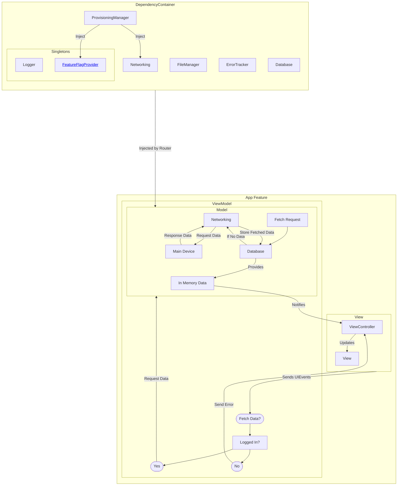
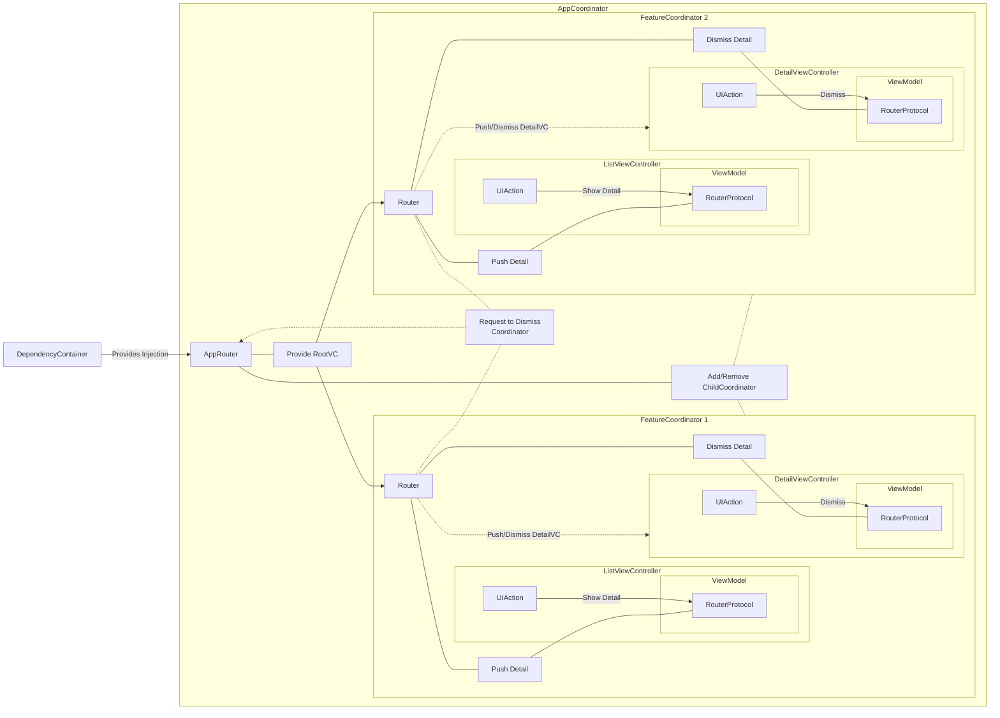

# Architecture

## MVVM

## Coordinator / Router

### Navigation using Coordinators and Routers
The below diagram is an example of how Navigation should be handled. By using this design pattern, we can navigate to any part of the Application through Universal/Deep Links.

