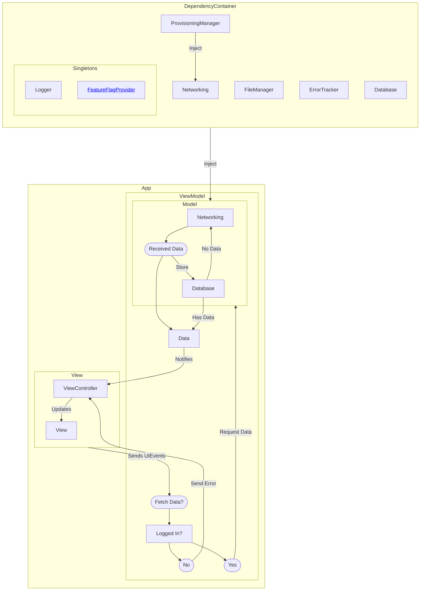

# Architecture

```mermaid
flowchart TD
    subgraph DC[DependencyContainer]
      direction TB
      FileManager
      ErrorTracker
      subgraph Singletons
        direction TB
        Logger
        FFP[<a href='./README.md'>FeatureFlagProvider</a>]
      end
      DCDB[Database]
      DCNW[Networking]
      PM[ProvisioningManager]
      PM -- Inject --> DCNW
    end
    subgraph App
      direction LR
      subgraph VM[ViewModel]
        direction LR
        Data
        FD([Fetch Data?])
        FD --> LI[Logged In?]
        LI --> VMN([No])
        LI --> VMY([Yes])
        VMY -- Request Data ----> M
        subgraph M[Model]
          direction LR
          NW[Networking]
          DB[Database]
          NW --> RD([Received Data])
          RD -- Store --> DB
          DB -- No Data --> NW
        end
        RD --> Data
        DB -- Has Data --> Data
      end
      VMN -- Send Error --> VC
      Data -- Notifies --> VC
      subgraph V[View]
        direction LR
        VC[ViewController]
        VC -- Updates --> View
      end
      V -- Sends UIEvents ----> FD
    end
    DC -- Inject ----> M
```
