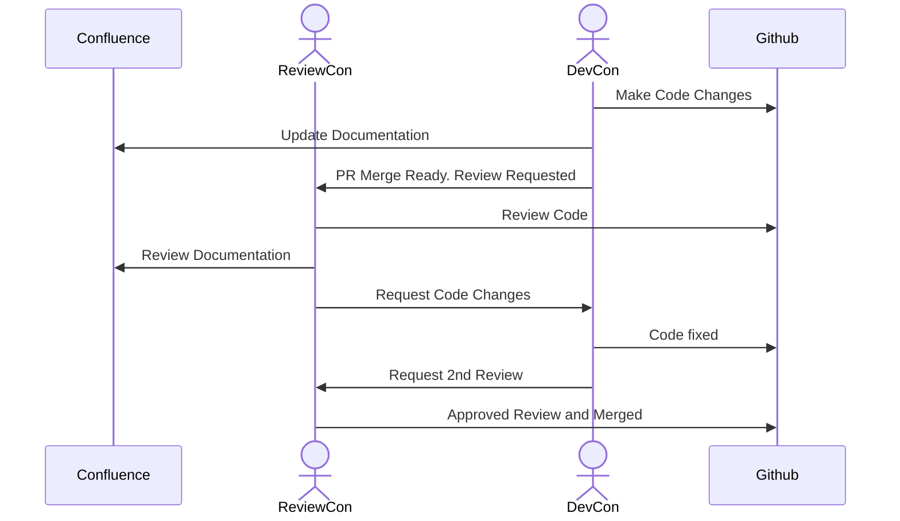
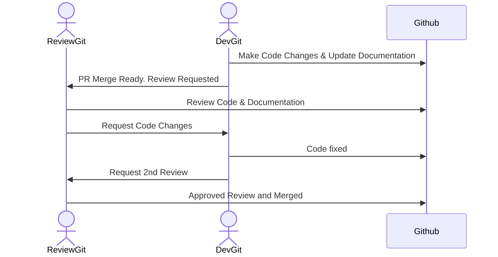

# Documentation Platform

| Comparison | Github | Confluence |
| ------ | ----- | ----- |
| Features | Markdown & Mermaid Graphs | WYSIWYG (Code Cells, Markdown, etc.) |
| Location | Code & Docs Centralized | Separated - Github & Confluence |
| Editing | PR Reviewed | Freely changeable |
| Versioning | Code Diff - Squash Commit | Page History - Multiple Changes |
| Review Code & Docs | Together | Separate |
| Reverts | Both reverted together | Very difficult due to versioning | 
| Accessibility | Github Permissions | Confluence Permissions (Accessible by Product) |
| Graphs | Built-in & Reviewable | Customizable Draw.io |
| Templates | Markdown Templates (Copy Paste) | Configurable Templates Per Space (Admins only) |
| Collaboration | Through PR | Live-Editing / Inline Comments |
| Structure | File Structure | Child/Parent - Parents can be Docs |
| Searchability | File Search (Code search future) | Text Search |
| Atlassian | Automatic Links to JIRA Tickets | Seamless Integration with all Products - Manual |
| Analytics | Unavailable | Number of Reads/Views |

## Confluence vs Github Workflow

