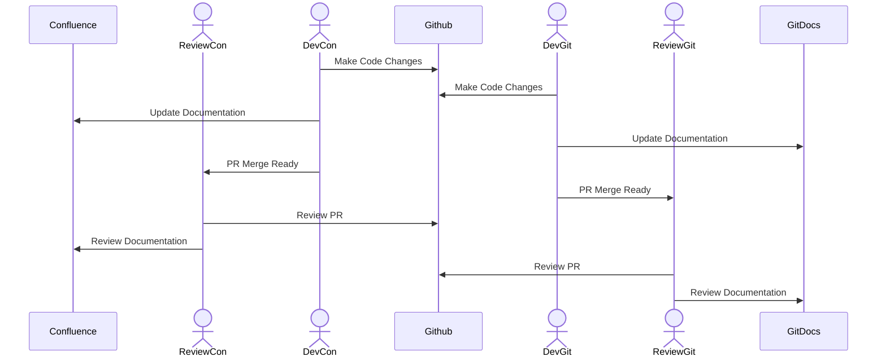

# Documentation Platform

| Github |  | Confluence | |
| ------ | ----- | ----- | ----- |
| Pros | Cons | Pros | Cons |
| Everything in 1 Place | Markdown Only | WYSIWYG | No Approval Process |
| Merges through PR | Requires Github Access | Easily Accessible | |
| Version Controler |                | | | 

## Confluence vs Github Workflow

