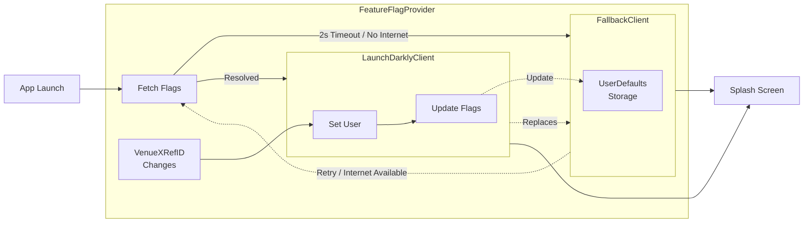

# Feature Flag Provider

```mermaid
flowchart LR;
    A[App Launch] --> FF;
    SP[Splash Screen];
    subgraph FeatureFlagProvider;
        direction LR;
        FF[Fetch Flags];
        ID[VenueXRefID<br/>Changes];
        FF -- 2s Timeout / No Internet --> FallbackClient;
        FF -- Resolved ----> LaunchDarklyClient;
        subgraph FallbackClient
            direction LR
            UDS[UserDefaults<br/>Storage];
        end
        FallbackClient -. Retry / Internet Available .-> FF;
        subgraph LaunchDarklyClient
            direction LR
            UF[Update Flags];
            SU[Set User];
            SU --> UF;
        end
        LaunchDarklyClient -. Replaces -.-> FallbackClient
        ID ---> SU
        UF -. Update .-> UDS;
    end
    FallbackClient --> SP;
    LaunchDarklyClient --> SP;
```