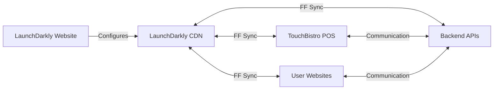
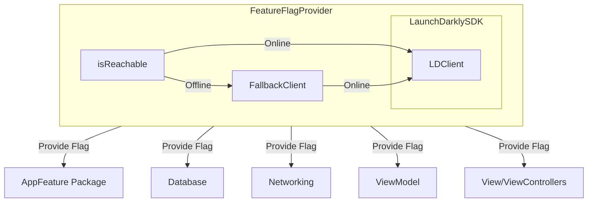
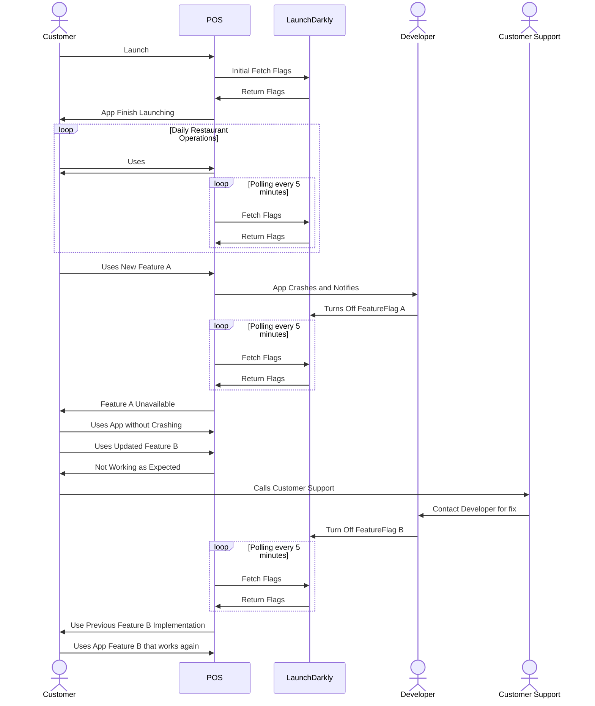
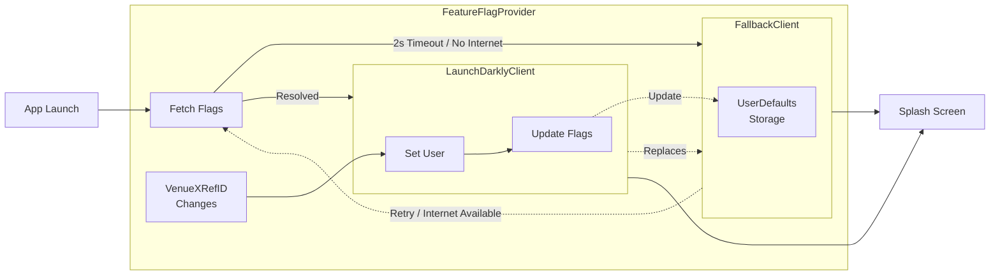

# Feature Flag Provider

## Product Requirements

### Problems:
1. The latest iOS app update is crashing in production. Every user who is up-to-date is unable to use the iOS app. However, releasing updates to the AppStore requires a review process that can take up-to 48 hours.
2. A team of Developers are working on a new Feature. They branch off `master` and complete this Feature after 1 month. When trying to merge the Feature into `master`, there's a ton of merge conflicts. After resolving them and merging, the app crashes and nobody knows why. 

### Solution:
We use Feature Flags(aka Remote Configs) to turn On/Off sections of code for all users. We can disable crashing code the moment we find out. Developers can incrementally work on new Features behind a FF to avoid merge hells.

## Architectural Plan

## Application Modules

## Transactions and User Flows

## In-depth Logic Flow (Experimental)

